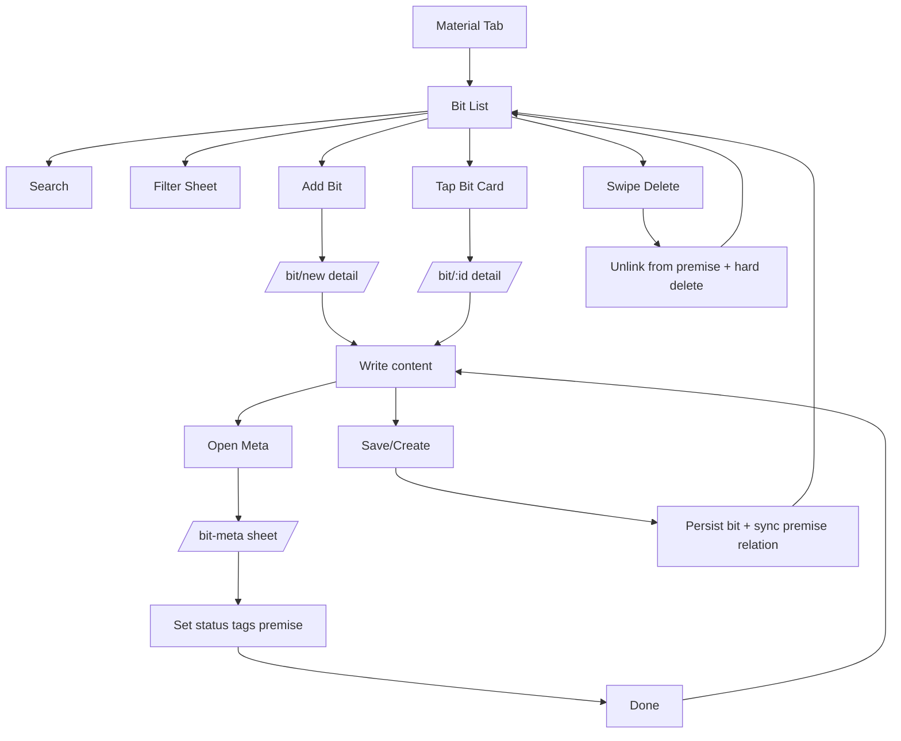

# Bit User Flow

## Purpose

Document end-to-end bit flow: writing content, managing metadata, linking premise, filtering, and deletion.

## Entry Points

- Bottom tab -> Material.
- Material segmented tabs -> Bit (`/material/bit`).
- Bit list FAB -> New bit (`/bit/new`).
- Bit card tap -> Edit bit (`/bit/:id`).
- Bit detail header -> Meta modal (`/bit-meta`).

## Primary Flows

### 1) Open Bit List

1. User opens Material tab.
2. User selects Bit tab.
3. App loads bits sorted by latest update.
4. User sees search, filter button, Add Bit FAB, and swipeable cards.

### 2) Search + Filter Bits

1. User types in search.
2. App filters client-side by bit content.
3. User taps filter button.
4. App opens filter sheet (`/bit-filter`).
5. User can select statuses, tags, and premise state (All / Has Premise / No Premise).
6. User taps Apply Filters.
7. Sheet closes and list applies route-param filters.

### 3) Create New Bit (Editor Flow)

1. User taps Add Bit FAB.
2. App opens bit detail in create mode (`/bit/new`).
3. User writes content in rich-text editor.
4. User can use toolbar style toggles (H1/H2/P).
5. User taps Create.
6. App saves bit to DB and navigates back.

### 4) Edit Existing Bit

1. User taps a bit card.
2. App opens edit mode (`/bit/:id`) with existing content.
3. User updates content.
4. User taps Save.
5. App updates bit and navigates back.

### 5) Edit Bit Metadata (Status, Tags, Premise)

1. User taps Meta in bit detail header.
2. App opens metadata form sheet (`/bit-meta`) with current values.
3. User changes status, tags, and/or connected premise.
4. User taps Done.
5. Sheet closes and returns metadata via route params + nonce.
6. Bit detail receives and applies metadata to local state.
7. User taps Save/Create to persist metadata with bit content.

### 6) Premise Link Behavior in Bit Detail

1. If bit has linked premise, app shows a premise banner at top.
2. User can expand/collapse the banner to preview premise content.
3. On Save/Create, app syncs relation:
   - If premise changed, remove bit id from previous premise.
   - Add bit id to new premise.
   - Keep `bit.premiseId` and `premise.bitIds` consistent.

### 7) Delete Bit

1. User swipes bit card.
2. User taps Delete.
3. App removes bit from linked premise relation (if exists).
4. App hard-deletes bit record.
5. List refreshes automatically.

## Behavior Notes

- Metadata modal changes are staged until Save/Create in bit detail.
- Closing bit detail without Save/Create discards staged metadata.
- Delete is hard delete, no undo.
- Filtered and searched list remains client-side over observed DB data.

## Flow Diagram

