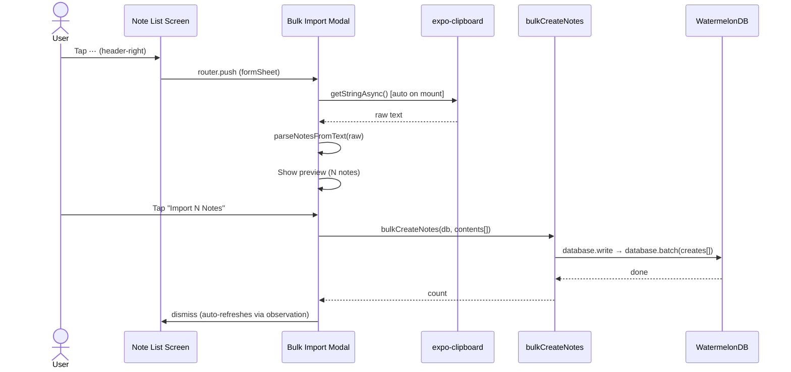

# Bulk Note Import — Implementation Plan

## Overview

Add a **three-dot menu button** in the top-right header of the Note List screen. The FAB ("New" button) stays as-is for quick single-note creation. The three-dot menu is the dedicated entry point for **migration/bulk operations** — starting with "Import Notes" which reads the user's clipboard directly via `expo-clipboard`, parses it into individual notes by blank-line separation, shows a preview, and batch-creates them.

---

## User Flow

```
Note List screen
  → FAB still works for quick "New Note" (unchanged)
  → Tap ⋯ (header-right)
    → Import modal opens (formSheet, ~85% detent)
      → App auto-reads clipboard via expo-clipboard
      → Preview shows parsed note count + individual note cards
      → User taps "Import X Notes"
      → Notes batch-created in WatermelonDB
      → Modal dismissed, list refreshes automatically
```

### Why Clipboard-Only (No TextArea Input)

- **Fewer steps:** User copies from Apple Notes → opens import → sees preview → taps import. No intermediate paste gesture needed.
- **Less error-prone:** No risk of partial paste, accidental edits, or keyboard covering the preview.
- **Cleaner UI:** The modal focuses entirely on review/confirmation rather than being an editor.
- **Privacy-transparent:** We read the clipboard once on modal open and show exactly what was read. The user can re-copy and tap "Refresh" if needed.

---

## Parsing Logic

Split the raw text on **one or more blank lines** (regex: `/\n\s*\n/`). Each resulting segment becomes one note. Empty/whitespace-only segments are discarded.

### Example

Input (copied from Apple Notes):
```
i have this note today.
people might think blabla

asdasdasdasd
asdasdasd

the third note here
```

Output → 3 notes:
1. `i have this note today.\npeople might think blabla`
2. `asdasdasdasd\nasdasdasd`
3. `the third note here`

---

## Architecture & File Plan

### 1. Header Change — Note List Screen

**File:** `src/app/(app)/(detail)/note/index.tsx`

- Keep the existing FAB button unchanged.
- Add `useLayoutEffect` → `navigation.setOptions({ headerRight })` with a three-dot icon button (`ellipsis-vertical` from Ionicons).
- On press → `router.push('/(app)/(modal)/note-bulk-import')` to open the import modal directly.

### 2. Bulk Import Modal (new route)

**New file:** `src/app/(app)/(modal)/note-bulk-import.tsx`

- Registered in `src/app/(app)/_layout.tsx` as a `formSheet` with ~0.85 detent.
- Modal header with Cancel / Import buttons (following `bit-meta.tsx` pattern).

**On mount behavior:**
1. Call `Clipboard.getStringAsync()` automatically.
2. Parse the clipboard text into note segments.
3. Display the preview.

**UI structure:**
- **Status bar:** Shows "X notes detected from clipboard" or "Clipboard is empty".
- **"Refresh Clipboard"** button — re-reads clipboard if the user goes back to copy something else.
- **Preview section:** ScrollView of parsed note cards, each showing the note content as a mini card with separators.
- **"Import X Notes"** button — bottom-anchored, disabled when 0 notes detected, calls `bulkCreateNotes`.
- **Loading/success state:** Button shows loading during DB write, modal auto-dismisses on success.

### 3. Bulk Create Service

**New file:** `src/features/note/services/bulk-create-notes.ts`

```ts
export function parseNotesFromText(raw: string): string[]
// Splits on blank lines, trims, filters empty

export async function bulkCreateNotes(database: Database, contents: string[]): Promise<number>
// Single database.write block with database.batch() for atomic creation
```

- Uses a **single `database.write` block** with `database.batch()` for performance — all notes are created atomically.
- Each note gets `content`, `createdAt`, `updatedAt` set to `new Date()`.

### 4. Layout Registration

**File:** `src/app/(app)/_layout.tsx`

Add one new `Stack.Screen` entry:
```tsx
<Stack.Screen name="(modal)/note-bulk-import" options={formSheet(field, 0.85)} />
```

### 5. Dependencies

**Install:** `expo-clipboard`

```bash
npx expo install expo-clipboard
```

Expo-maintained package with native clipboard access on both iOS and Android. Provides `Clipboard.getStringAsync()` for reading the system clipboard.

### 6. i18n Keys

Add to `notes` namespace in `en.ts` and `id.ts`:

```ts
notes: {
  // existing keys...
  bulkImport: {
    title: 'Import Notes',
    cancel: 'Cancel',
    refreshClipboard: 'Refresh Clipboard',
    noteCount: '%{count} notes detected from clipboard',
    noteCountSingular: '1 note detected from clipboard',
    importButton: 'Import %{count} Notes',
    importButtonSingular: 'Import 1 Note',
    success: 'Imported %{count} notes',
    empty: 'No notes detected. Copy your notes from another app, then open this screen. Separate notes with a blank line.',
    emptyClipboard: 'Clipboard is empty. Copy your notes from another app first.',
  },
}
```

---

## UI/UX Design Decisions

### FAB Stays, Menu is for Migration

- The FAB is the **fast path** for creating a single note — it stays.
- The ⋯ header button is the **dedicated entry point for migration/bulk operations** — a conceptually different action that deserves its own space.
- In the future, the ⋯ menu could expand to include "Export Notes", "Sort by", etc.

### Clipboard-First UX

| Aspect | Clipboard-only | TextArea input |
|--------|---------------|----------------|
| Steps to import | 3 (copy → open → confirm) | 4 (copy → open → paste → confirm) |
| Error surface | Low — what you see is what was copied | Higher — user might edit/corrupt text |
| Keyboard interference | None — no keyboard shown | Keyboard covers preview area |
| Modal focus | Review & confirm | Edit & confirm |

The clipboard-only approach is the right choice because the user's intent is clear: they've already prepared their text in another app. Our job is to parse and confirm, not to be another text editor.

### Import Modal UX Details

| Element | Spec |
|---------|------|
| Auto-read | Clipboard read on mount via `useEffect` |
| Status line | "3 notes detected from clipboard" — prominent, top of content |
| Refresh button | Small ghost button below status — re-reads clipboard |
| Preview | ScrollView of mini cards, each showing trimmed note content |
| Import button | Bottom-anchored. Disabled when 0 notes. Shows count in label |
| Loading state | Button shows loading indicator during DB write |
| Success | Modal auto-dismisses. List refreshes via WatermelonDB observation |
| Empty state | Friendly message explaining the copy-first workflow |

### Accessibility

- Three-dot button: `accessibilityLabel={t('notes.bulkImport.title')}`, `accessibilityRole="button"`.
- Refresh button: `accessibilityLabel={t('notes.bulkImport.refreshClipboard')}`.
- Import button: `accessibilityLabel` with dynamic count.
- Preview cards: `accessibilityRole="text"` with note content.

---

## Performance Considerations

Following **Vercel React Native Best Practices**:

1. **Batch DB writes:** Use `database.batch()` inside a single `database.write()` call — avoids N separate write transactions.
2. **Preview list:** Simple `ScrollView` with `.map()` for typical import sizes. If we find users importing 50+ notes, upgrade to `FlashList`.
3. **Clipboard read:** `Clipboard.getStringAsync()` is async but fast. Show a brief loading state on mount.
4. **Memoize parsed notes:** `useMemo` over the clipboard text to avoid re-parsing on every render.
5. **Stable callbacks:** `useCallback` for `handleImport` and `handleRefreshClipboard`.

---

## Testing Plan

### Unit Tests (`src/features/note/services/bulk-create-notes.test.ts`)

- `parseNotesFromText`: empty string → `[]`
- `parseNotesFromText`: single paragraph → `[text]`
- `parseNotesFromText`: two paragraphs separated by blank line → `[text1, text2]`
- `parseNotesFromText`: multiple consecutive blank lines → same as single blank line
- `parseNotesFromText`: trailing/leading whitespace trimmed per segment
- `parseNotesFromText`: whitespace-only segments discarded
- `parseNotesFromText`: lines with only spaces between paragraphs count as blank
- `bulkCreateNotes`: creates correct number of notes in DB

---

## File Summary

| Action | File |
|--------|------|
| **Modify** | `src/app/(app)/(detail)/note/index.tsx` — Add header-right ⋯ button (FAB unchanged) |
| **Modify** | `src/app/(app)/_layout.tsx` — Register `note-bulk-import` modal route |
| **Modify** | `src/i18n/locales/en.ts` — Add `notes.bulkImport.*` keys |
| **Modify** | `src/i18n/locales/id.ts` — Add corresponding Indonesian translations |
| **Create** | `src/app/(app)/(modal)/note-bulk-import.tsx` — Bulk import modal |
| **Create** | `src/features/note/services/bulk-create-notes.ts` — Parse + batch create logic |
| **Create** | `src/features/note/services/bulk-create-notes.test.ts` — Unit tests |
| **Install** | `expo-clipboard` — Clipboard access |

---

## Sequence Diagram


