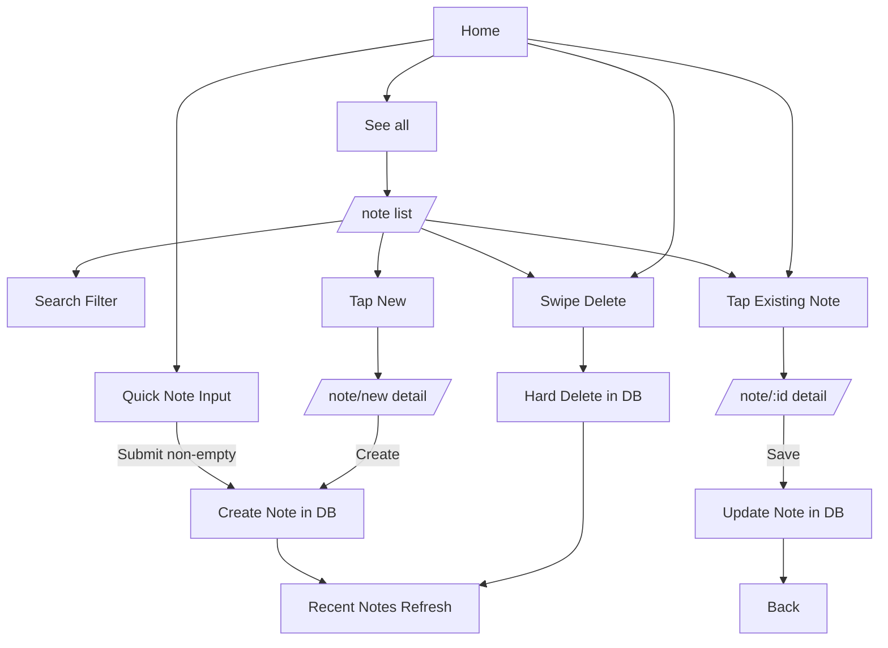

# Note User Flow

## Purpose

Document end-to-end user flow for creating, viewing, editing, searching, and deleting notes.

## Entry Points

- Home tab -> Quick note bar at bottom.
- Home tab -> Recent Notes -> See all -> Note list (`/note`).
- Home tab -> Tap a note card -> Note detail (`/note/:id`).
- Note list -> Tap New -> New note (`/note/new`).

## Primary Flows

### 1) Quick Create from Home

1. User opens the Home tab.
2. User types in Quick Note input (`What's funny?...`).
3. User taps send icon (or submits from keyboard).
4. App validates that content is not empty.
5. App writes a new note to DB immediately.
6. Input clears after success.
7. Recent Notes updates automatically (observed query, newest first).

### 2) Open All Notes + Search

1. User taps See all in Recent Notes.
2. App opens Note list screen (`/note`).
3. User types into search field.
4. App applies client-side filtering by note content.
5. List updates live while user types.

### 3) Create Note from Note List

1. User taps New in Note list header.
2. App opens Note detail in create mode (`/note/new`).
3. User writes content.
4. Create button enables only when content is not empty.
5. User taps Create.
6. App saves note to DB.
7. App navigates back.
8. New note appears at top (sorted by `updated_at desc`).

### 4) Edit Existing Note

1. User opens a note from Home or Note list.
2. App opens Note detail in edit mode (`/note/:id`).
3. Existing content is loaded and observed live.
4. User edits content.
5. User taps Save.
6. App updates content and `updatedAt`.
7. App navigates back.

### 5) Delete Note (Home or Note List)

1. User swipes a note card to reveal delete action.
2. User taps Delete.
3. App permanently deletes note from DB.
4. Observed lists update automatically.

## Behavior Notes

- No autosave: changes persist only after Save/Create.
- Back without Save/Create discards unsaved edits.
- Delete is hard delete (`destroyPermanently`), no undo.
- Home shows latest 6 notes; Note list shows all notes.
- Home and Note list both refresh on focus to avoid stale UI.

## Flow Diagram

