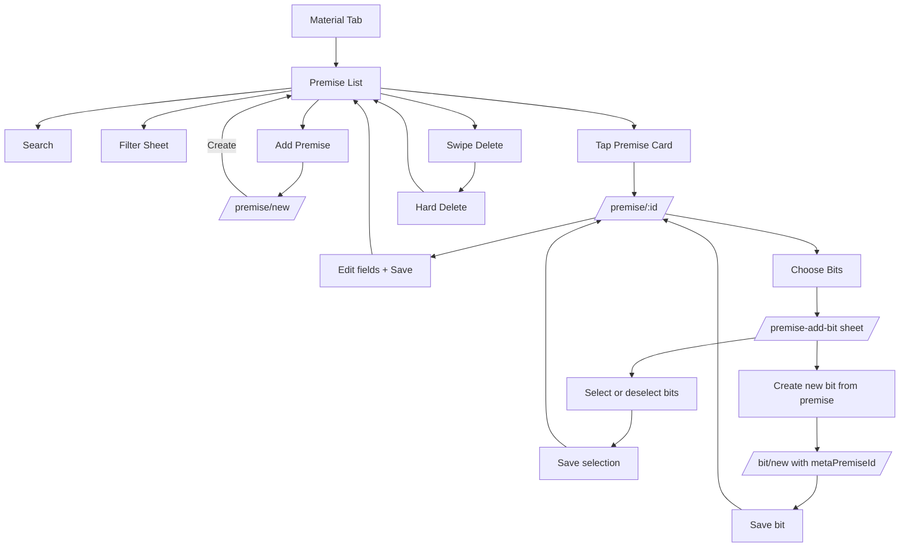

# Premise User Flow

## Purpose

Document full user flow for premise management, including metadata, filtering, and linking bits.

## Entry Points

- Bottom tab -> Material.
- Material segmented tabs -> Premise (`/material/premise`).
- Premise list FAB -> New premise (`/premise/new`).
- Premise card tap -> Edit premise (`/premise/:id`).

## Primary Flows

### 1) Open Premise List

1. User opens Material tab.
2. User selects Premise tab.
3. App loads premises sorted by latest update.
4. User sees search, filter button, Add Premise FAB, and swipeable cards.

### 2) Search + Filter Premises

1. User types in search.
2. App filters client-side by premise content.
3. User taps filter button.
4. App opens filter sheet (`/premise-filter`).
5. User can select status, tags, and attitude.
6. User taps Apply Filters.
7. Sheet closes and list updates using route params.
8. User can tap Reset in the sheet to clear all filters.

### 3) Create New Premise

1. User taps Add Premise FAB.
2. App opens create form (`/premise/new`).
3. User fills premise content (required).
4. User optionally edits status, attitude, and tags.
5. User taps Create.
6. App saves premise and navigates back.
7. New premise appears at top of list.

### 4) Edit Existing Premise

1. User taps a premise card.
2. App opens edit form (`/premise/:id`) with existing values.
3. User updates content/status/attitude/tags.
4. User taps Save.
5. App updates premise and navigates back.

### 5) Link or Unlink Bits from Premise

This flow is available only for existing premise (`/premise/:id`), not new premise.

1. User opens existing premise detail.
2. User taps Choose Bits.
3. App opens bit picker form sheet (`/premise-add-bit`).
4. In sheet, user can:
   - Search bits.
   - Select multiple bits.
   - See relation badge (`Linked here` or `Linked to another premise`).
5. User taps Save (`Save (n)`).
6. Sheet dismisses to the same premise detail route with selected ids in params.
7. Premise detail applies selected bits:
   - Removes links for deselected bits.
   - Adds links for newly selected bits.
   - Updates `premise.bitIds`.
8. UI shows updated connected bit count.

### 6) Create New Bit from Premise Bit Picker

1. In Choose Bits sheet, user taps Create a new bit from this premise.
2. Sheet closes.
3. App opens bit create screen (`/bit/new`) with prefilled `metaPremiseId`.
4. User writes and saves the bit.
5. Bit is created and linked to that premise.
6. Returning to premise detail shows updated connected count.

### 7) Delete Premise

1. User swipes premise card in list.
2. User taps Delete.
3. App hard-deletes premise.
4. List refreshes automatically.

## Behavior Notes

- New premise cannot choose bits until it is saved first.
- Bit-link apply flow updates both sides of relation (`bit.premiseId` and `premise.bitIds`).
- Premise applies selected bits only when `bitsNonce` param exists (apply-once guard).
- Delete is hard delete, no undo.

## Flow Diagram

