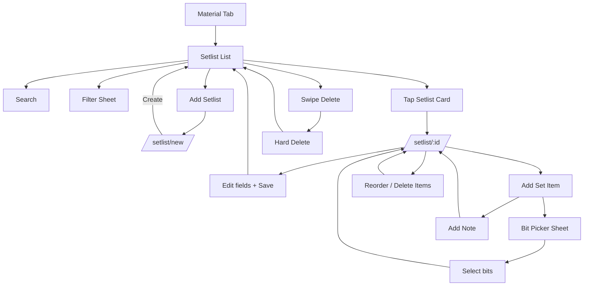

# Setlist User Flow

## Purpose

Document end-to-end setlist flow: building ordered sets, adding bits/notes, filtering, and deletion.

## Entry Points

- Bottom tab -> Material.
- Material segmented tabs -> Setlist (`/material/setlist`).
- Setlist list FAB -> New setlist (`/setlist/new`).
- Setlist card tap -> Edit setlist (`/setlist/:id`).

## Primary Flows

### 1) Open Setlist List

1. User opens Material tab.
2. User selects Setlist tab.
3. App loads setlists sorted by latest update.
4. User sees search, filter button, Add Setlist FAB, and swipeable cards.

### 2) Search + Filter Setlists

1. User types in search.
2. App filters client-side by description.
3. User taps filter button.
4. App opens filter sheet (`/setlist-filter`).
5. User selects tags derived from persisted setlists.
6. User taps Apply Filters.
7. Sheet closes and list applies route-param filters.
8. User can tap Reset in the sheet to clear all filters.

### 3) Create New Setlist

1. User taps Add Setlist FAB.
2. App opens create form (`/setlist/new`).
3. User fills description (required).
4. User optionally adds tags.
5. User taps Add Set Item and chooses Bit or Note.
6. User taps Create.
7. App saves setlist and navigates back.
8. New setlist appears at top of list.

### 4) Edit Existing Setlist

1. User taps a setlist card.
2. App opens edit form (`/setlist/:id`) with existing values.
3. User updates description, tags, or items.
4. User taps Save.
5. App updates setlist and navigates back.

### 5) Add Bits to a Setlist

1. User taps Add Set Item and selects Bit.
2. App opens bit picker form sheet (`/setlist-add-bit`).
3. User searches and selects one or more bits.
4. User taps Add.
5. Sheet closes and returns selected ids via route params + nonce.
6. Setlist detail applies added bits once and clears the params.

### 6) Add Notes to a Setlist

1. User taps Add Set Item and selects Note.
2. App opens note dialog.
3. User writes a note and taps Add Note.
4. Note appears in the items list.

### 7) Reorder or Remove Items

1. User long-presses an item and drags to reorder.
2. User swipes an item to reveal Delete.
3. User taps Delete to remove the item.
4. Reordered/removed items are persisted on Save.

### 8) Delete Setlist

1. User swipes a setlist card in list.
2. User taps Delete.
3. App hard-deletes setlist.
4. List refreshes automatically.

## Behavior Notes

- New setlist cannot add bits until it is saved with an id (items are staged locally).
- Add-bit applies only when `addedBitsNonce` param exists (apply-once guard).
- Delete is hard delete, no undo.
- Filtered and searched list remains client-side over observed DB data.

## Flow Diagram

